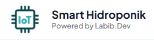

<div align="center">
  
</div>

<h3 align="center">Smart Hydroponic: IoT & Expert System Monitoring</h3>

<div align="center">

[]()
[]()
[]() 
[]()
[]()
[](LICENSE.md)

</div>

---

<p align="center"> 
    Sistem monitoring hidroponik cerdas yang menggabungkan sensor IoT Real-time dengan <b>Kecerdasan Artificial (KA)</b> untuk memberikan saran dosis nutrisi otomatis.
    <br> 
</p>

## 📝 Table of Contents

- [Demo & Preview](#demo)
- [Problem Statement](#problem_statement)
- [Idea / Solution](#idea)
- [System Architecture](#architecture)
- [Hardware Requirements](#hardware)
- [Setting up Environment](#getting_started)
- [Usage](#usage)
- [Technology Stack](#tech_stack)
- [Authors](#authors)

## 🎥 Demo & Preview <a name = "demo"></a>

Berikut adalah tampilan dashboard monitoring yang menampilkan data real-time dari tandon nutrisi:

<div align="center">

### 🚀 [AKSES DEMO DASHBOARD](http://localhost:8000) 🚀
*(Link demo publik jika ada)*

</div>

<br>

<div align="center">
  
  <br>
  <i>Dashboard Monitoring Suhu, Nutrisi (PPM), dan Volume Air</i>
</div>

---

## 🧐 Problem Statement <a name = "problem_statement"></a>

Analisis masalah yang melatarbelakangi pembuatan sistem ini:

- **IDEAL:** Petani hidroponik seharusnya dapat mengetahui kondisi air tandon (suhu, nutrisi, volume) kapan saja dan di mana saja untuk memastikan pertumbuhan tanaman yang optimal. Perhitungan dosis pupuk tambahan harus akurat berdasarkan volume air aktual.

- **REALITY:** Pengecekan masih dilakukan secara manual menggunakan alat ukur celup (TDS Meter & Termometer). Seringkali petani "mengira-ngira" takaran pupuk tambahan tanpa mengetahui volume air sisa di dalam tandon yang tertutup rapat.

- **CONSEQUENCES:** Ketidaktahuan kondisi air secara real-time menyebabkan keterlambatan penanganan (misal: air terlalu panas atau nutrisi habis). Pemberian dosis pupuk yang tidak presisi (Overdosis/Kurang) dapat menyebabkan tanaman terbakar (nutrient burn) atau tumbuh kerdil.

## 💡 Idea / Solution <a name = "idea"></a>

**Smart Hydroponic System** hadir menggabungkan perangkat keras (IoT) dan perangkat lunak cerdas.

Solusi kami meliputi:
1.  **Sensing:** Menggunakan sensor **Ultrasonic** (Volume), **TDS** (Kepekatan Nutrisi), dan **DHT22** (Suhu & Kelembaban) yang terhubung ke ESP32.
2.  **Transmission:** Data dikirim via protokol **MQTT** yang ringan dan cepat ke server Laravel.
3.  **Processing (KA):** Sistem Pakar di server menghitung selisih target PPM dengan PPM aktual, lalu mengkalkulasi dosis pupuk (ml) yang tepat berdasarkan volume air saat itu.
4.  **Action:** Memberikan notifikasi "WARNING", "OVER", atau "OPTIMAL" langsung ke dashboard petani.

## ⛓️ System Architecture <a name = "architecture"></a>

Alur data dalam sistem ini:

`[Sensor]` -> `[ESP32]` -> `(WiFi)` -> `[MQTT Broker]` -> `[Laravel Worker]` -> `[Database MySQL]` -> `[Web Dashboard]`

## 🛠️ Hardware Requirements <a name = "hardware"></a>

- **Microcontroller:** ESP32 DevKit V1
- **Sensors:**
  - HC-SR04 (Ultrasonic) - Untuk ukur ketinggian air.
  - TDS Meter Analog - Untuk ukur kepekatan nutrisi.
  - DHT22 - Untuk ukur suhu dan kelembaban udara.
- **Connectivity:** Kabel Micro USB & WiFi 2.4Ghz.

## 🏁 Getting Started <a name = "getting_started"></a>

Instruksi ini untuk menjalankan server Laravel dan Worker MQTT di komputer lokal.

### Prerequisites

Pastikan software berikut terinstal:
- PHP >= 8.1
- Composer
- MySQL
- **MQTT Broker** (Mosquitto / EMQX) - *Wajib jalan di port 1883*

### Installing (Software Side)

1. **Clone Repositori**
    ```bash
    git clone https://github.com/LabibAbdullah1/SmartHydroponic.git
    cd SmartHydroponic
    ```

2. **Instal Dependensi**
    ```bash
    composer install
    npm install && npm run build
    ```

3. **Konfigurasi Environment**
    Duplikat `.env.example` jadi `.env`. Sesuaikan database dan konfigurasi MQTT:
    
    ```ini
    DB_DATABASE=iot_hidroponik
    
    # Konfigurasi MQTT
    MQTT_HOST=127.0.0.1
    MQTT_PORT=1883
    MQTT_TOPIC=hidroponik/telemetry
    ```

4. **Migrasi Database**
    ```bash
    php artisan key:generate
    php artisan migrate
    php artisan db:seed
    ```

5. **Jalankan Sistem**
    Anda perlu membuka 2 terminal berbeda:
    
    *Terminal 1 (Web Server):*
    ```bash
    php artisan serve
    ```
    
    *Terminal 2 (MQTT Worker - Otak KA):*
    ```bash
    php artisan mqtt:subscribe
    ```

## 🎈 Usage <a name="usage"></a>

1. **Setup Hardware:** Nyalakan ESP32 yang sudah diprogram. Pastikan terhubung ke WiFi dan Broker MQTT yang sama dengan Laptop.
2. **Monitoring:** Buka dashboard. Grafik akan bergerak otomatis saat data sensor masuk.
3. **Konfigurasi Lahan:** Masuk ke menu pengaturan untuk input dimensi tandon (Panjang x Lebar x Tinggi) dan Target PPM Tanaman.
4. **Analisis KA:** Cek kotak "Analisa Data". Jika nutrisi kurang, sistem akan memberi tahu berapa mililiter pupuk A & B yang harus dituang.

## ⛏️ Built With <a name = "tech_stack"></a>

- [Laravel 10](https://laravel.com/) - Backend & KA Logic
- [JavaScript (AJAX)](https://developer.mozilla.org/en-US/docs/Web/Guide/AJAX) - Realtime Data Fetching
- [Tailwind CSS](https://tailwindcss.com/) - Modern Styling
- [Chart.js](https://www.chartjs.org/) - Data Visualization
- [PhpMqtt](https://github.com/php-mqtt/client) - MQTT Client Library
- [C++ (Arduino IDE)](https://www.arduino.cc/) - Firmware ESP32

## ✍️ Authors <a name = "authors"></a>

- **[Labib Abdullah]** - *Fullstack IoT Developer*

---
<div align="center">
  Developed for Smart Farming Project & Education Purpose.
</div>
